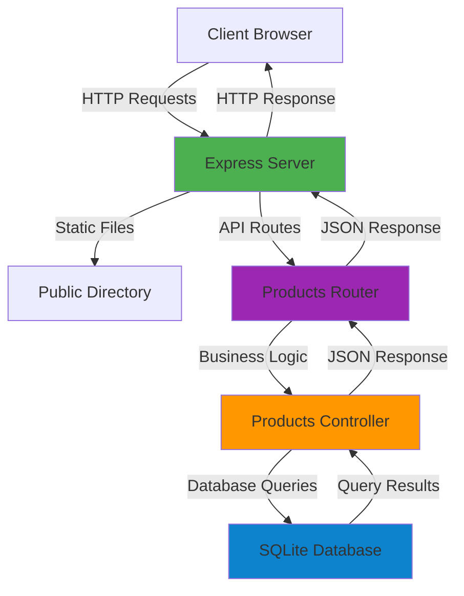

# Spiral Sounds

> A modern, full-stack e-commerce platform for classic vinyl records built with Express.js and SQLite.

[](https://nodejs.org/)
[](https://expressjs.com/)
[](https://www.sqlite.org/)
[](LICENSE)

---

## 📖 Introduction

**Spiral Sounds** is a full-stack web application that provides a seamless shopping experience for vinyl record enthusiasts. Built as a learning project from Scrimba's Fullstack Express course, this application demonstrates modern web development practices including RESTful API design, database management, and responsive frontend development.

The application features a clean, intuitive interface for browsing and searching through a curated collection of classic vinyl records, with robust backend infrastructure supporting filtering, search, and product management capabilities.

---

## ✨ Key Features

### 🎵 Product Management
- **Browse Collection**: Explore a curated selection of classic vinyl records
- **Genre Filtering**: Filter products by music genre (Rock, Pop, Jazz, Classical, etc.)
- **Advanced Search**: Search across album titles, artist names, and genres
- **Product Details**: View comprehensive product information including price, year, and stock availability

### 🎨 User Experience
- **Responsive Design**: Fully responsive layout optimized for desktop, tablet, and mobile devices
- **Modern UI**: Clean, professional interface with intuitive navigation
- **Real-time Updates**: Dynamic content loading without page refreshes
- **Accessible**: Built with accessibility best practices (ARIA labels, semantic HTML)

### 🔧 Technical Features
- **RESTful API**: Well-structured API endpoints following REST conventions
- **SQLite Database**: Lightweight, file-based database for easy deployment
- **MVC Architecture**: Separation of concerns with controllers, routes, and models
- **Error Handling**: Comprehensive error handling with meaningful error messages
- **Static File Serving**: Efficient serving of images and static assets

---

## 🏗️ Overall Architecture

Spiral Sounds follows a **Model-View-Controller (MVC)** architectural pattern, ensuring clean separation of concerns and maintainable code structure.



### Architecture Components

#### **Frontend Layer**
- **Static Files**: HTML, CSS, and JavaScript served directly by Express
- **Client-Side Logic**: Vanilla JavaScript for dynamic content rendering
- **API Consumption**: Fetch API for communicating with backend endpoints

#### **Backend Layer**
- **Express Server**: HTTP server handling requests and serving static files
- **Route Handlers**: Modular route definitions for API endpoints
- **Controllers**: Business logic and database interaction handlers
- **Database Layer**: SQLite database with connection management

#### **Data Flow**
1. User interacts with frontend (search, filter, browse)
2. Frontend makes API requests to Express server
3. Express routes requests to appropriate controllers
4. Controllers query SQLite database
5. Results are formatted and returned as JSON
6. Frontend updates UI with received data

---

## 🚀 Installation

### Prerequisites

Before you begin, ensure you have the following installed on your system:

- **Node.js** (v14.0.0 or higher) - [Download Node.js](https://nodejs.org/)
- **npm** (v6.0.0 or higher) - Comes bundled with Node.js
- **Git** (optional) - For cloning the repository

### Step-by-Step Installation

1. **Clone the repository** (or download and extract the project):
   ```bash
   git clone <repository-url>
   cd Fullstack_Express_Scrimba
   ```

2. **Install project dependencies**:
   ```bash
   npm install
   ```
   
   This will install the following packages:
   - `express` - Web framework for Node.js
   - `sqlite` - SQLite database wrapper
   - `sqlite3` - SQLite database driver

3. **Initialize the database**:
   ```bash
   node createTable.js
   ```
   
   This creates the `products` table in the SQLite database.

4. **Seed the database with sample data**:
   ```bash
   node seedTable.js
   ```
   
   This populates the database with initial product records.

5. **Verify installation**:
   ```bash
   npm start
   ```
   
   If successful, you should see:
   ```
   Server running at http://localhost:8000
   ```

---

## ▶️ Running the Project

### Development Mode

Start the development server:

```bash
npm start
```

The server will start on **port 8000** by default. Open your browser and navigate to:

```
http://localhost:8000
```

### Available Scripts

| Command | Description |
|---------|-------------|
| `npm start` | Starts the Express server on port 8000 |

### Database Management Scripts

| Script | Purpose |
|--------|---------|
| `node createTable.js` | Creates the products table in the database |
| `node seedTable.js` | Populates the database with sample data |
| `node logTable.js` | (If available) Logs database contents for debugging |

### Stopping the Server

Press `Ctrl + C` (or `Cmd + C` on macOS) in the terminal to stop the server.

---

## ⚙️ Environment Configuration

Currently, Spiral Sounds uses **hardcoded configuration values**. For production deployments, we recommend using environment variables.

### Current Configuration

The application uses the following default settings:

- **Port**: `8000` (defined in `server.js`)
- **Database**: `database.db` (SQLite file in project root)
- **Static Files**: `public/` directory

### Recommended Environment Variables

To make the application more flexible, you can modify `server.js` to use environment variables:

```javascript
// Example: Using environment variables
const PORT = process.env.PORT || 8000
const DB_PATH = process.env.DB_PATH || 'database.db'
```

Create a `.env` file in the project root:

```env
PORT=8000
DB_PATH=database.db
NODE_ENV=development
```

**Note**: To use `.env` files, you'll need to install `dotenv`:
```bash
npm install dotenv
```

Then add to the top of `server.js`:
```javascript
import 'dotenv/config'
```

---

## 📁 Folder Structure

```
Fullstack_Express_Scrimba/
│
├── 📂 controllers/              # Business logic layer
│   └── productsControllers.js  # Product-related request handlers
│
├── 📂 db/                       # Database layer
│   └── db.js                    # Database connection utility
│
├── 📂 routes/                   # API route definitions
│   └── products.js              # Product API routes
│
├── 📂 public/                   # Frontend static files
│   ├── 📂 images/               # Product images and assets
│   │   ├── spiral_logo.png
│   │   └── vinyl*.png
│   ├── index.html               # Main HTML page
│   ├── index.css                # Stylesheet
│   └── index.js                 # Client-side JavaScript
│
├── 📄 server.js                 # Express server entry point
├── 📄 createTable.js            # Database table creation script
├── 📄 seedTable.js              # Database seeding script
├── 📄 logTable.js               # Database logging utility (optional)
├── 📄 data.js                   # Sample product data
├── 📄 database.db               # SQLite database file (generated)
│
├── 📄 package.json              # Project dependencies and scripts
├── 📄 package-lock.json         # Dependency lock file
└── 📄 README.md                 # Project documentation
```

### Directory Descriptions

| Directory | Purpose |
|-----------|---------|
| `controllers/` | Contains request handlers that process business logic and interact with the database |
| `db/` | Database connection and configuration utilities |
| `routes/` | Express route definitions that map URLs to controller functions |
| `public/` | Static files served directly to clients (HTML, CSS, JS, images) |
| Root | Configuration files, database scripts, and entry point |

---

## 🤝 Contribution Guidelines

We welcome contributions to Spiral Sounds! Whether you're fixing bugs, adding features, or improving documentation, your help is appreciated.

### Getting Started

1. **Fork the repository** (if applicable) or create a feature branch
2. **Create your feature branch**:
   ```bash
   git checkout -b feature/your-feature-name
   ```

### Development Workflow

1. **Follow the existing code style**:
   - Use ES6+ JavaScript features
   - Maintain consistent indentation (2 spaces)
   - Use meaningful variable and function names
   - Add comments for complex logic

2. **Test your changes**:
   - Ensure the server starts without errors
   - Test API endpoints manually or with tools like Postman
   - Verify frontend functionality in multiple browsers

3. **Commit your changes**:
   ```bash
   git commit -m "Add: descriptive commit message"
   ```

### Code Style Guidelines

- **Naming Conventions**:
  - Use `camelCase` for variables and functions
  - Use `PascalCase` for classes/components
  - Use `UPPER_SNAKE_CASE` for constants

- **File Organization**:
  - Keep controllers focused on single responsibilities
  - Group related routes together
  - Maintain clear separation between frontend and backend

- **Error Handling**:
  - Always use try-catch blocks for async operations
  - Return meaningful error messages
  - Use appropriate HTTP status codes

### Pull Request Process

1. Update the README.md with details of changes if applicable
2. Ensure your code follows the project's style guidelines
3. Test thoroughly before submitting
4. Provide a clear description of your changes

### Areas for Contribution

- 🐛 **Bug Fixes**: Report or fix issues you encounter
- ✨ **New Features**: Add functionality like user authentication, shopping cart, etc.
- 📝 **Documentation**: Improve documentation clarity and examples
- 🎨 **UI/UX**: Enhance the frontend design and user experience
- ⚡ **Performance**: Optimize database queries and frontend rendering
- 🧪 **Testing**: Add unit tests or integration tests

---

## 📄 License

This project is licensed under the **ISC License**.

```
ISC License

Copyright (c) 2024, Tom Chant

Permission to use, copy, modify, and/or distribute this software for any
purpose with or without fee is hereby granted, provided that the above
copyright notice and this permission notice appear in all copies.

THE SOFTWARE IS PROVIDED "AS IS" AND THE AUTHOR DISCLAIMS ALL WARRANTIES
WITH REGARD TO THIS SOFTWARE INCLUDING ALL IMPLIED WARRANTIES OF
MERCHANTABILITY AND FITNESS. IN NO EVENT SHALL THE AUTHOR BE LIABLE FOR
ANY SPECIAL, DIRECT, INDIRECT, OR CONSEQUENTIAL DAMAGES OR ANY DAMAGES
WHATSOEVER RESULTING FROM LOSS OF USE, DATA OR PROFITS, WHETHER IN AN
ACTION OF CONTRACT, NEGLIGENCE OR OTHER TORTIOUS ACTION, ARISING OUT OF
OR IN CONNECTION WITH THE USE OR PERFORMANCE OF THIS SOFTWARE.
```

---

## 🗺️ Roadmap

Spiral Sounds is an active learning project with plans for continuous improvement. Here's what we're working towards:

### 🎯 Short-term Goals (v1.1 - v1.2)

- [ ] **User Authentication**
  - User registration and login
  - Session management
  - Protected routes

- [ ] **Shopping Cart**
  - Add/remove items from cart
  - Cart persistence
  - Checkout process

- [ ] **Product Management**
  - Admin panel for product CRUD operations
  - Image upload functionality
  - Bulk import/export

- [ ] **Enhanced Search**
  - Advanced filtering (price range, year range)
  - Sorting options (price, year, title)
  - Search result pagination

### 🚀 Medium-term Goals (v1.3 - v2.0)

- [ ] **Order Management**
  - Order history
  - Order tracking
  - Email notifications

- [ ] **Payment Integration**
  - Stripe/PayPal integration
  - Secure payment processing
  - Invoice generation

- [ ] **User Profiles**
  - User dashboard
  - Wishlist functionality
  - Review and rating system

- [ ] **Performance Optimization**
  - Database indexing
  - Caching layer (Redis)
  - Image optimization and CDN

### 🌟 Long-term Vision (v2.0+)

- [ ] **Multi-vendor Support**
  - Vendor registration
  - Vendor dashboards
  - Commission management

- [ ] **Mobile Application**
  - React Native app
  - Push notifications
  - Mobile-optimized experience

- [ ] **Analytics & Reporting**
  - Sales analytics dashboard
  - User behavior tracking
  - Inventory management

- [ ] **API Documentation**
  - OpenAPI/Swagger documentation
  - API versioning
  - Rate limiting

- [ ] **Testing & CI/CD**
  - Unit and integration tests
  - Automated testing pipeline
  - Continuous deployment

### 📊 Database Schema Enhancements

Future database improvements:
- User authentication tables
- Orders and order items tables
- Cart and cart items tables
- Reviews and ratings tables
- Payment transactions table

---

## 📡 API Reference

### Base URL

```
http://localhost:8000/api
```

### Endpoints

#### Get All Products

Retrieve all products with optional filtering and search.

```http
GET /api/products
```

**Query Parameters:**

| Parameter | Type | Description | Example |
|-----------|------|-------------|---------|
| `genre` | string | Filter by genre | `?genre=Rock` |
| `search` | string | Search in title, artist, or genre | `?search=beatles` |

**Example Request:**
```bash
curl http://localhost:8000/api/products?genre=Rock
```

**Example Response:**
```json
[
  {
    "id": 1,
    "title": "Abbey Road",
    "artist": "The Beatles",
    "price": 29.99,
    "image": "vinyl1.png",
    "year": 1969,
    "genre": "Rock",
    "stock": 10
  }
]
```

#### Get All Genres

Retrieve a list of all available genres.

```http
GET /api/products/genres
```

**Example Request:**
```bash
curl http://localhost:8000/api/products/genres
```

**Example Response:**
```json
["Rock", "Pop", "Jazz", "Classical"]
```

### Error Responses

All endpoints may return the following error responses:

**500 Internal Server Error**
```json
{
  "error": "Failed to fetch products",
  "details": "Error message details"
}
```

---

## 🗄️ Database Schema

### Products Table

| Column | Type | Constraints | Description |
|--------|------|-------------|-------------|
| `id` | INTEGER | PRIMARY KEY, AUTOINCREMENT | Unique product identifier |
| `title` | TEXT | NOT NULL | Album title |
| `artist` | TEXT | NOT NULL | Artist name |
| `price` | REAL | NOT NULL | Product price in USD |
| `image` | TEXT | NOT NULL | Image filename |
| `year` | INTEGER | | Release year |
| `genre` | TEXT | | Music genre |
| `stock` | INTEGER | | Available stock quantity |

**Example SQL Query:**
```sql
CREATE TABLE IF NOT EXISTS products (
  id INTEGER PRIMARY KEY AUTOINCREMENT, 
  title TEXT NOT NULL, 
  artist TEXT NOT NULL,
  price REAL NOT NULL,
  image TEXT NOT NULL,
  year INTEGER,
  genre TEXT,
  stock INTEGER 
)
```

---

## 🛠️ Tech Stack

### Backend
- **Node.js** - JavaScript runtime environment
- **Express.js** - Fast, unopinionated web framework
- **SQLite3** - Lightweight, file-based database
- **sqlite** - Modern SQLite wrapper for Node.js

### Frontend
- **HTML5** - Semantic markup
- **CSS3** - Modern styling with responsive design
- **Vanilla JavaScript (ES6+)** - Client-side interactivity
- **Fetch API** - HTTP requests

### Development Tools
- **npm** - Package manager
- **Git** - Version control

---

## 🐛 Troubleshooting

### Common Issues

**Port Already in Use**
```
Error: listen EADDRINUSE: address already in use :::8000
```
**Solution**: Change the port in `server.js` or stop the process using port 8000.

**Database Not Found**
```
Error: SQLITE_CANTOPEN: unable to open database file
```
**Solution**: Run `node createTable.js` to create the database file.

**Module Not Found**
```
Error: Cannot find module 'express'
```
**Solution**: Run `npm install` to install all dependencies.

**CORS Issues**
If accessing the API from a different origin, you may need to add CORS middleware:
```bash
npm install cors
```

---

## 📚 Learning Resources

This project was built as part of the Scrimba Fullstack Express course. Key concepts demonstrated:

- Express.js server setup and routing
- RESTful API design principles
- SQLite database operations
- MVC architecture pattern
- Frontend-backend integration
- Error handling and validation

---

## 👤 Author

**Tom Chant**

Built with ❤️ while learning from [Scrimba](https://scrimba.com/)

---

## 🙏 Acknowledgments

- Scrimba for the excellent fullstack development course
- Express.js community for the amazing framework
- All contributors and users of this project

---

**Happy Coding! 🎵**
